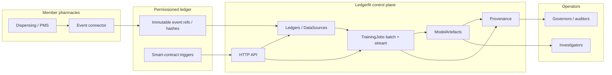

# Ledgerfit

**Source:** `ai-in-decentralized+ai/2019-03-blockchain-ml-taowang-v2-190322201510/`
**Domain:** `ai-decentralized`
**One-liner:** A permissioned-ledger ML control plane that trains association and risk models only from immutable multi-pharmacy prescription events, with smart-contract-triggered retrain and score cycles for controlled-substance surveillance.
**Wedge:** Multi-pharmacy / controlled-substance surveillance networks — three or more dispensing sites sharing opioid and related prescription events on a permissioned chain, starting with association-rule mining (support ≥20%, confidence ≥70%) and automated lifecycle jobs. Not a crypto token marketplace.
**Positioning:** Trustable AutoML for regulated healthcare consortia, sitting between SingularityNET’s AGI marketplace (“shoot the moon”) and DanKu’s Ethereum-only neural-net contests (“down to earth”). Tao Wang’s 2019 SAS thesis argues blockchain as the trusted immutable data source for ML and smart contracts as native automation for train/score/tune timing; Ledgerfit productises that Unified Analytical Framework for pharmacy networks that refuse mutable shared databases and speculative tokens.

## Market research synthesis

### Thesis from source

Tao Wang’s 2019 SAS presentation *Blockchain, AI and Machine Learning* frames a fusion agenda: blockchain supplies decentralized trust across untrusted participants (citing Gartner’s analytics ramifications), and AI in turn makes blockchain smarter. The core failure modes of status-quo ML are trust and automation. Models train on mutable databases that system admins or attackers can alter; timing to train, score, and tune is ad hoc. The proposed fix is dual: train only on data anchored to an immutable ledger, and run the ML lifecycle as smart contracts — “automated processes” native to the chain — so retrain and score cycles are policy-driven rather than calendar folklore.

Wang positions a Unified Analytical Framework between existing extremes. SingularityNET is characterised as AGI-marketplace ambition with AGI-token economics (ICO raised ~$36m in 60 seconds in the deck’s 2019 snapshot). DanKu is “down to earth” neural-net evaluation on Ethereum with reward-giver / model-provider contests, but limited to that chain and NNET. The proposed framework prefers **permissioned** blockchains, has little to do with token/money, and is not AGI-first. Architecture layers are explicit: **Core ML** (init, train, validate, score, evaluate, serialize, clean-up) → **Server Layer** (SMP/MPP batch from blockchain via SQL/APIs, one-shot heavy lifting across the full chain) → **Streaming Layer** (online models from the ever-growing chain) → **Smart Contract Layer** (native automation plus optional reward settlement for model contribution — without productising a public token).

The beachhead experiment is concrete: a Kaleido permissioned network (quorum/raft), three pharmacies logging opioid transactions (or hashes/pointers), Server-Layer retrieval via SQL into CAS-style analytics, and association rule mining with support ≥20%, confidence ≥70%, ≤3 items per rule. Sixteen synthetic rules appeared (e.g. actiq & fentora ⇒ meperidine); Wang notes synthetic opioid-only data makes clinical sense weak, but with real prescriptions ARM should surface gateway non-opioids, frequent opioid/non-opioid combinations, and other surveillance signals. Closing remarks: use blockchain for trustable-AI and AutoML; use AI to make blockchain smarter. A privacy caution from public Bitcoin analytics (transaction-graph deanonymization) reinforces why regulated health data belongs on permissioned, not public, chains.

### Buyer & economic model

- **Primary buyer:** Pharmacy network CISO / Chief Compliance Officer, or a state PDMP / controlled-substance program director sponsoring multi-site surveillance without a mutable shared warehouse.
- **Users:** pharmacy data stewards, clinical pharmacists / diversion investigators, ML ops analysts, consortium governors, external auditors / regulators.
- **Budget owner / value metric:** compliance and diversion-prevention budget (plus shared analytics ops); value metric is audit-defensible models whose training corpus and retrain triggers are ledger-proven — fewer unexplained model drifts and fewer “who changed the extract?” disputes.
- **Competing status quo:** nightly CSV dumps into a central data lake; Excel/SQL rule hunting; one-off data-sharing MOUs; public-chain ML contests or AGI marketplaces that introduce token risk and privacy exposure.

### Domain constraints

- **Regulatory / trust / safety:** Controlled-substance and prescription-privacy regimes (e.g. PDMP-style access controls, HIPAA-class PHI); models must not invent clinical causality from synthetic or incomplete ledgers; human review before enforcement actions against patients or prescribers.
- **Data sensitivity:** Prescription events are highly sensitive; public-chain analytics risks deanonymization (Wang’s Bitcoin pizza-graph caution). Prefer permissioned membership, hashed payloads or off-chain pointers with on-chain integrity, and no speculative token that invites public observers.
- **Change-management realities:** Pharmacies will not abandon dispensing systems; Ledgerfit must accept ledger-anchored events (or hashes) from existing POS/PMS connectors and schedule ML jobs without requiring every site to run full SMP/MPP stacks locally.

## Business requirements

- BR-1: Every training or scoring corpus used for production surveillance models must resolve only to ledger-anchored prescription events (or cryptographically verified pointers) from approved member pharmacies — never to an editable admin extract as the system of truth.
- BR-2: Association and risk models for the controlled-substance wedge must support configurable rule thresholds (default support ≥20%, confidence ≥70%, max items ≤3) with versioned policy approval before production use.
- BR-3: Train, score, and tune cycles for approved models must be schedulable as policy-triggered automated processes (smart-contract-equivalent triggers), not solely as ad-hoc analyst calendar jobs.
- BR-4: When new qualifying ledger blocks or event batches arrive, streaming or incremental update paths must be available so online models can refresh without waiting for a full batch rebuild.
- BR-5: Batch rebuilds over the full approved ledger window must remain available for heavy association mining and model evaluation, with clear lineage from chain height / block range to model artefact.
- BR-6: The product must operate on permissioned networks with named institutional membership; public-chain token marketplaces and AGI-token economics are explicitly out of commercial scope.
- BR-7: Model artefacts promoted to surveillance use must carry provenance: source ledger identity, event window, thresholds, trigger that initiated the job, and evaluator identity.
- BR-8: Investigators must be able to inspect surfaced rules (e.g. co-prescription patterns, gateway non-opioid candidates) with patient/prescriber identifiers masked by policy until a dual-control reveal is approved.
- BR-9: Any member pharmacy or consortium governor must be able to freeze outbound event anchoring or model scoring for their site within a published SLA without erasing historical provenance records.
- BR-10: Synthetic or test ledgers must be labelled as non-clinical; production promotion gates must refuse models whose only evidence is synthetic opioid-only data.
- BR-11: Commercial packaging must support consortium cost-sharing for ledger ops and analytics without requiring a native cryptocurrency or ICO.
- BR-12: Audit exports must demonstrate immutability claims (event hashes, job triggers, artefact digests) for a regulator or external auditor without exposing unnecessary PHI.

## User stories

Canonical user stories live in sibling [USER_STORIES.md](USER_STORIES.md).

## System design

### Overview

Ledgerfit is a trustable AutoML control plane for permissioned multi-pharmacy networks. Member pharmacies anchor controlled-substance and related prescription events (or integrity hashes with off-chain payloads) to a shared permissioned ledger. Analysts and automated triggers pull approved windows into batch (Server Layer) or streaming (Streaming Layer) jobs that run Core ML routines — starting with association rule mining and extensible to other risk models. Smart-contract-style triggers encode when to initialise, train, validate, score, evaluate, and serialize models. Promoted artefacts and their provenance are retained for investigator workflows and regulatory audit. The product deliberately excludes public AGI marketplaces and native token economies.

### Actors & boundaries

- **Actors:** member pharmacies, compliance officers, diversion investigators, data stewards, ML ops analysts, consortium governors, regulators/auditors, optional reward settlement for model contribution (off-token or internal credits only).
- **Trust boundary:** raw PHI may remain off-chain with on-chain hashes; Ledgerfit APIs see membership metadata, event references, job configs, artefacts, and provenance — not a public mempool of prescriptions.
- **Human-in-the-loop points:** membership approval, threshold policy, production promotion, dual-control identity reveal, site freeze, exception approval for non-ledger pilot data (never for production).

### Core capabilities

1. **Ledgers / data sources** — register permissioned networks, member pharmacies, and event schemas
2. **Training jobs** — batch Server-Layer and streaming jobs over ledger windows
3. **Model artefacts** — versioned ARM/risk models with evaluation metrics and promotion state
4. **Smart-contract triggers** — policy automation for train/score/tune lifecycle
5. **Provenance** — immutable lineage from events → jobs → artefacts → decisions
6. **Investigation workspace** — masked rule hits, dual-control reveal, case notes
7. **Governance & freeze** — membership, policy versions, site kill-switch, audit export

### Conceptual data

- **Primary entities:** LedgerNetwork, PharmacyMember, PrescriptionEventRef, DataSourcePolicy, TrainingJob, ModelArtefact, AssociationRule, SmartContractTrigger, ProvenanceRecord, RevealRequest, FreezeOrder.
- **Critical events:** event anchored, job triggered, job completed/failed, artefact promoted/rejected, rule surfaced, reveal approved/denied, freeze issued, audit pack exported.
- **Retention / audit needs:** provenance, trigger history, and promotion decisions retained for the consortium’s regulatory dispute window; PHI payloads retained per pharmacy policy (prefer hash-on-chain).

### Integrations (conceptual)

- **Systems of record:** pharmacy management / POS systems, existing PDMP feeds where applicable, permissioned blockchain fabric (e.g. Kaleido-class), institutional IdP.
- **Upstream signals:** dispensing events, controlled-substance schedules, member DPIA / BAA status, threshold policies.
- **Downstream actions:** investigator case queues, compliance dashboards, regulator audit packs, optional internal contribution credits (non-token).

### High-level architecture

Member pharmacies publish events to a permissioned ledger; Ledgerfit’s API authenticates consortium operators and service keys, then orchestrates Core ML through batch and streaming adapters. Triggers on the smart-contract layer schedule lifecycle steps; artefacts and provenance feed investigation and audit channels.

### Success metrics

- **Leading:** % of production models with complete ledger lineage; median time from qualifying new events to automated score; share of jobs initiated by approved triggers vs. manual; freeze acknowledgement latency.
- **Lagging:** audit findings related to training-data integrity; investigator time-to-first-actionable rule on real (non-synthetic) data; reduction in disputed “who changed the extract” incidents; successful regulator attestations without token/public-chain exceptions.

## OpenAPI skeleton

Canonical HTTP surface lives in sibling `openapi.yaml`. Summarize here:

- **Base path:** `/v1/...`
- **Auth:** API key (`X-API-Key`) and Bearer JWT (operator)
- **Resource groups:** LedgersDataSources, TrainingJobs, ModelArtefacts, SmartContractTriggers, Provenance
