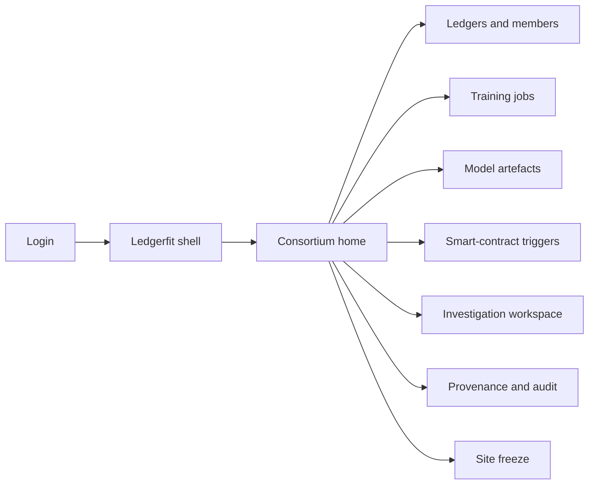
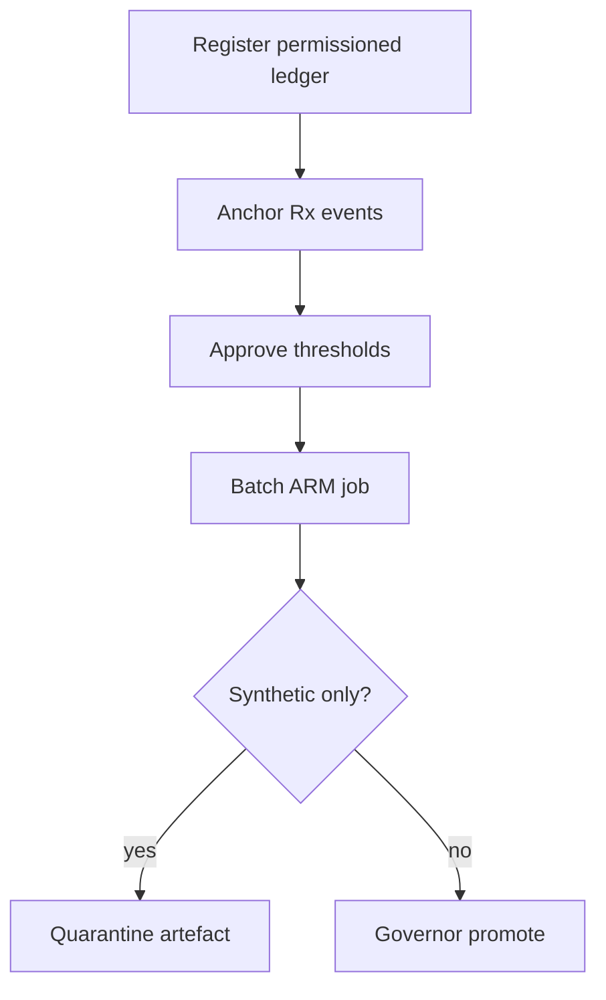

# Ledgerfit — Web app

**Product:** [PRODUCT.md](./PRODUCT.md)
**Primary surface:** Pharmacy-consortium surveillance console (ledger-anchored AutoML + investigation)
**Secondary surfaces:** Regulator provenance export viewer (read-only); site freeze acknowledgement strip
**Design thesis:** Ledgerfit is a permissioned evidence desk for controlled-substance surveillance — the UI metaphor is a sealed chain-of-custody binder meeting a rule-mining lab bench, not a crypto trading terminal or AGI marketplace. Visual language is deep navy with sterile mint confirmation on sealed provenance and amber for masked PHI awaiting dual-control reveal. The brand wordmark sits as a quiet seal on every model-promotion and investigation screen so governors know whose immutability claim they are trusting.

## UX research synthesis

### Category peers (best-in-class)

- **Bamboo Health / PDMP clinician portals:** Controlled-substance query workflows with role-gated PHI and audit of every reveal. Steal: masked-by-default identity with dual-control unlock; reject consumer-health wellness aesthetics.
- **SAS Viya Model Manager:** Versioned artefacts, promotion gates, and lineage from data to score. Steal: explicit train → validate → promote states with evaluator identity; reject generic “insights” tiles that hide threshold policy.
- **Kaleido / Hyperledger Fabric consoles:** Permissioned membership, channel health, and block-height orientation. Steal: named institutional members and chain-height lineage on every job; reject public-mempool explorer chrome and token balances.
- **Appriss / diversion analytics workspaces:** Investigator queues for co-prescription and anomalous dispensing patterns. Steal: rule-hit prioritisation with case notes; reject speculative token reward dashboards.

### Patterns to adopt / reject

- **Adopt:** Ledger window + block height as mandatory job inputs; support/confidence/max-items policy chips on every ARM view; synthetic-data quarantine badge; smart-contract trigger timeline; masked rule hits; dual-control reveal; freeze SLA.
- **Reject:** Public-chain wallet UX; SingularityNET-style AGI marketplace browse; editable training extracts as system of truth; clinical causality claims from synthetic opioid-only pilots; purple AI glow.

### Trust, density, and workflow constraints from PRODUCT.md

Production models must resolve only to ledger-anchored events (BR-1). Thresholds are versioned policy (BR-2). Lifecycle automation via triggers, not calendar folklore (BR-3). Batch and streaming paths both visible (BR-4, BR-5). Permissioned membership only — no tokens (BR-6, BR-11). Provenance on every promoted artefact (BR-7). PHI masked until dual-control (BR-8). Site freeze without erasing history (BR-9). Synthetic labelled and blocked from production (BR-10). Audit exports without unnecessary PHI (BR-12).

## Information architecture

### Nav model

### Roles → default home

| Role | Default home | Why |
|------|--------------|-----|
| Compliance officer | Consortium home — lineage health | Defend training integrity (BR-1) |
| Diversion investigator | Investigation workspace | Prioritise masked rule hits (BR-8) |
| Pharmacy data steward | Ledgers and members / Freeze | Anchoring health and kill-switch (BR-9) |
| ML ops analyst | Training jobs | Batch vs stream choice (BR-4, BR-5) |
| Consortium governor | Model artefacts promotion | Approve thresholds and membership (BR-2, BR-6) |
| External auditor | Provenance and audit | Immutability export (BR-12) |

### Cross-links to OpenAPI resources

| Nav area | OpenAPI tags / resources |
|----------|---------------------------|
| Ledgers and members | LedgersDataSources |
| Training jobs | TrainingJobs |
| Model artefacts | ModelArtefacts |
| Smart-contract triggers | SmartContractTriggers |
| Provenance and audit | Provenance |

## Screen inventory

### Consortium home

- **Purpose:** Answer “are today’s surveillance models still ledger-proven and trigger-driven?” in one composition.
- **Entry:** Post-login for compliance/governor roles.
- **Layout regions:** Brand + network switcher; % models with complete lineage; last trigger-fired job; synthetic quarantine alerts; member freeze strip.
- **Primary actions:** Open failing lineage; review pending promotions; export audit pack.
- **Empty / loading / error:** Empty = register first permissioned ledger; error = retry with request id.
- **BR / story ties:** BR-1, BR-7; compliance officer stories.

### Ledgers and members

- **Purpose:** Register permissioned networks, pharmacies, and event schemas; refuse public-chain token sources.
- **Entry:** Nav → Ledgers.
- **Layout regions:** Network list (permissioned only); member roster; connector status; event schema; chain height health.
- **Primary actions:** Register ledger; add pharmacy; disable non-permissioned source attempts with reason.
- **Empty / loading / error:** Connector fault banner; empty = Kaleido-class onboarding checklist.
- **BR / story ties:** BR-1, BR-6; data steward stories.

### Training jobs (batch and stream)

- **Purpose:** Run Server-Layer batch over ledger windows or Streaming-Layer incremental updates with clear lineage.
- **Entry:** Nav → Training jobs; trigger deep link.
- **Layout regions:** Job table (batch/stream, window, block range, status); config pane (thresholds default 20%/70%/≤3); trigger that initiated job; failure diagnostics.
- **Primary actions:** Launch batch; enable stream; cancel; open artefact on success.
- **Empty / loading / error:** Reject if data source not registered ledger (BR-1); synthetic-only corpus warning.
- **BR / story ties:** BR-2, BR-3, BR-4, BR-5; ML ops stories.

### Model artefacts and promotion

- **Purpose:** Version ARM/risk models; gate production; quarantine synthetic evidence.
- **Entry:** Job complete; nav → Models.
- **Layout regions:** Artefact list; metrics; provenance summary; synthetic badge; promote/reject with evaluator identity.
- **Primary actions:** Promote; reject; compare versions; open investigation rules.
- **Empty / loading / error:** Production promotion blocked when only synthetic opioid-only evidence (BR-10).
- **BR / story ties:** BR-7, BR-10; governor stories.

### Smart-contract triggers

- **Purpose:** Encode train/score/tune as policy automation, not ad-hoc notebooks.
- **Entry:** Nav → Triggers; model detail.
- **Layout regions:** Trigger list (event batch arrival, schedule, threshold change); linked models; fire history; pause/resume.
- **Primary actions:** Create trigger; simulate; pause; view last fire → job.
- **Empty / loading / error:** Empty = suggest default “on new qualifying blocks” template.
- **BR / story ties:** BR-3; compliance automation stories.

### Investigation workspace

- **Purpose:** Inspect association rules with identifiers masked until dual-control reveal.
- **Entry:** Investigator default; model → rules.
- **Layout regions:** Rule queue (support, confidence, itemset); masked hit table; dual-control reveal panel; case notes; gateway non-opioid hypothesis tags.
- **Primary actions:** Prioritise rule; request reveal; approve/deny reveal; open case.
- **Empty / loading / error:** Empty = no rules above policy; reveal denied logged.
- **BR / story ties:** BR-2, BR-8; investigator stories.

### Provenance and audit export

- **Purpose:** Demonstrate event hashes, triggers, artefact digests without unnecessary PHI.
- **Entry:** Auditor home; governor export.
- **Layout regions:** Lineage graph (events → job → artefact → decision); pack builder; hash verify.
- **Primary actions:** Export pack; verify digests; share time-boxed link.
- **Empty / loading / error:** Incomplete lineage = coral blocking state for production claims.
- **BR / story ties:** BR-7, BR-12.

### Site freeze

- **Purpose:** Freeze outbound anchoring or scoring for a pharmacy within SLA without erasing history.
- **Entry:** Steward alerts; nav → Freeze.
- **Layout regions:** Active freezes; SLA countdown; affected jobs; release with dual control.
- **Primary actions:** Issue freeze; acknowledge; release.
- **Empty / loading / error:** Empty = healthy state with last drill; SLA breach highlighted.
- **BR / story ties:** BR-9.

### Threshold policy editor

- **Purpose:** Version support/confidence/max-items before production use.
- **Entry:** From jobs or governor nav.
- **Layout regions:** Policy versions; diff; approval record; default 20% / 70% / ≤3 callout.
- **Primary actions:** Propose version; approve; apply to models.
- **Empty / loading / error:** Unapproved draft cannot bind to production jobs.
- **BR / story ties:** BR-2.

## Key flows

1. **Ledger-proven ARM cycle** — register ledger → anchor events → policy thresholds → batch job over window → evaluate → promote or quarantine synthetic (BR-1, BR-2, BR-5, BR-10).

2. **Trigger-driven rescore** — new blocks → smart-contract trigger → streaming or batch job → provenance append (BR-3, BR-4).

3. **Masked investigation** — rule surfaces → investigator reviews masked hits → dual-control reveal → case notes (BR-8).

4. **Site freeze** — connector fault → freeze anchoring/scoring → jobs skip site → history retained (BR-9).

5. **Regulator export** — select models in use → pack hashes/triggers/windows → download without PHI dump (BR-12).

## Design system

### Tokens (CSS variables)

- `--color-ink: #E8EEF4` — primary text
- `--color-navy-950: #070B14` — app ground
- `--color-navy-900: #101828` — panels
- `--color-navy-700: #2A3A52` — rules
- `--color-mint: #3DCFB0` — sealed provenance / promoted
- `--color-mint-dim: #1F6B5A` — mint on dark
- `--color-amber: #E6A23C` — masked PHI / pending reveal
- `--color-coral: #E85D4C` — freeze / synthetic production block
- `--color-steel: #8A9BB0` — secondary labels
- `--color-brand: #9BB8D4` — Ledgerfit wordmark (cool steel-blue, not neon)
- `--font-display: "Source Serif 4", serif` — screen titles (custody binder feel)
- `--font-body: "IBM Plex Sans", sans-serif`
- `--font-mono: "IBM Plex Mono", monospace` — block heights, hashes, rule ids
- `--space-1`…`--space-8`: 4px scale
- `--radius-sm: 4px`; `--radius-md: 6px` — sharp custody forms
- `--motion-seal: 180ms ease-out` — provenance lock
- `--motion-reveal: 240ms ease-in-out` — amber reveal panel
- `--motion-trigger: 200ms ease-out` — trigger fire pulse
- Atmosphere: subtle chain-link watermark in navy-900; no crypto-coin imagery; no public explorer heatmaps.

### Typography & brand

- Serif display for titles and policy names; mono for block range and digests.
- Brand wordmark on every promotion and investigation view.
- Login: brand hero; headline (“Train only on sealed ledger events”); one CTA — no token price widgets.

### Do / don’t

- **Do:** Require ledger window on jobs; badge synthetic; mask PHI; show trigger that fired each job; cost-share without wallets (BR-11).
- **Don’t:** Purple marketplace browse; editable CSV as truth; clinical certainty language on synthetic pilots; rounded-full crypto pills.

### Accessibility & domain trust cues

- AA+ contrast; reveal states use text + icon, not colour alone.
- Live regions for freeze and promotion decisions.
- Focus order: ledger → job → artefact → investigation → export.

## Component patterns

- **LedgerWindowPicker** — block height / event range mandatory control.
- **ThresholdPolicyChip** — support / confidence / max-items version.
- **SyntheticQuarantineBadge** — non-clinical evidence marker.
- **ProvenanceLineageRail** — events → trigger → job → artefact.
- **MaskedHitRow** — PHI hidden until dual-control.
- **RevealDualControl** — requester/approver split.
- **TriggerFireTimeline** — automation history for a model.
- **SiteFreezeBanner** — SLA-bound kill-switch chrome.

## Out of scope for v1 web

- Public AGI marketplaces and native cryptocurrency / ICO UX (BR-6, BR-11); patient-facing apps; full EHR replacement; Ethereum contest marketplaces (DanKu-class); media deepfake tools.
